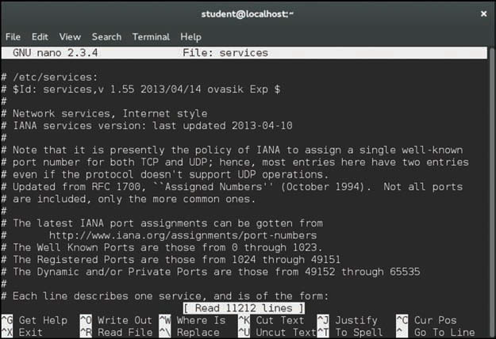

# Text Editors

As a developer, you will edit text files on a regular basis. This can sometimes pose a challenge
because Linux offers a variety of editors. In many cases, you should be able to pick your editor,
but sometimes you might be forced to use one of the standard editors, such as the vi editor.

## The vi Editor

Consider the early days of Unix, the precursor to Linux: A developer would sit down at a
keyboard, ready to edit a program that he is working on. He stares at the printer (yes, printer,
not monitor) considering what commands to execute. Monitors were very rare in the early
1970s and even if a developer had one, it was primarily designed to display the output of
executed code, not to interactively edit files.

Instead, the developer would use a simple command-based editor, such as the ed editor.
With this editor a developer could perform operations such as list the contents of a file
(print the file), modify specific characters of a file, or save the contents of a file. However,
he accomplished all this in a way that might seem foreign today. The developer wouldn’t
see what he was editing, but rather just assume the commands were successful (or print the
file to verify).

When monitors became more commonplace, the ed editor seemed like a clumsy way to edit a
text file. In the mid-1970s a replacement editor named vi (short for visual) was introduced to
Unix. It was a great improvement over the ed editor because you could actually see and move
around in your document.

## Why Learn vi?
You will soon discover that some editors are easier to use than vi. This discovery will result in
your asking the question, “Why the heck should I bother learning the vi editor?” Several good
reasons exist, even if you never plan on using the vi editor on a daily basis:

- vi requires no GUI
- vi is a very stable standard
- vi is always there
- Speed of use

## What Is vim?
The vim editor5 was released in 1991 as a clone of the vi editor. The vim editor has the same
base functionality as the vi editor, but it has several additional features. Some of these features
can be useful for software developers.

## Essential vi Commands

To become an expert vi user can take a lot of practice, but to be able to effectively edit files
requires the knowledge of a subset of the large amount of vi commands.

It helps to have a large file to edit. All Linux distributions should come with a /etc/services
file that is typically thousands of lines long. You can start by first copying this file to your
home directory and then edit the copy with the vi command:

```bash
cp /etc/services.
vi services
```
### Entering Insert Mode
When you first start the vi editor, you are placed in the command mode. This mode allows you
to perform commands such as moving around the screen, copying text, and deleting text.

While in the command mode, you can’t insert new text into your document because all the
keyboard keys are assigned to command tasks. To insert new text, you must use the s command
to move from command mode to insert mode.

- i—New text will appear before the cursor position.
- a—New text will appear after the cursor position.
- I—New text will appear at the beginning of the line.
- A—New text will appear at the end of the line.
- o—Opens a new line below the line that contains the cursor; new text will be placed on
this line.
- O—Opens a new line above the line that contains the cursor; new text will be placed on
this line.


Note that when you are using the vim editor and enter the insert mode, the bottom part of the
screen changes to indicate this. See the -- INSERT -- at the bottom


If you are working in a standard vi editor, then -- INSERT -- does not appear at the bottom
of the screen by default. To enable this feature in a standard vi editor, type the following
command while in command mode:

`
:set showmode
`

When you want to return to command mode, just press the escape (Esc) key. This is normally
denoted in documentation as <ESC>. If you return to the command mode, then the -- INSERT --
should disappear from the bottom of the screen.

### Movement Commands

While in the command mode, you can move the cursor in your document by using a variety
of keys. One of the common methods is to move the cursor one character to the left or right or
one line up or down. You do this by using either the arrow keys on your keyboard or using the
h, j, k, and l keys7 as shown in below.


Many additional movement commands are available, including the following:
- $ Move to the last column (character) on the current line
- 0 Move to the first column (character) on the current line
- w Move to the beginning of the next word or punctuation mark
- W Move to past the next space
- b Move to the beginning of the previous word’s punctuation mark
- B Move to the beginning of the previous word, ignoring punctuation
- e Move to the end of next word or punctuation mark
- E Move to the end of next word, ignoring punctuation
- ) Move forward one sentence

- ( Move back one sentence
- } Move forward one paragraph
- { Move back one paragraph
- H Move to the top of the screen
- M Move to the middle of the screen
- L Move to the bottom of the screen
- [[ Move to the beginning of the document
- ]] Move to the end of the document
- G Move to the end of the document (same as ]])
- xG Move to line x (you can also use :x)

Note that these are just some of the movement commands. Here’s a suggestion: spend some
time trying out these movement commands and then create a cheat sheet of the commands
that you feel will be most useful to you. Make this a cheat sheet that you can add more
commands to as you learn additional useful commands.

### Repeater Modifiers

In the previous section, you discovered that you can jump to a specific line in a document
by typing a number followed by a G while you are in the command-mode. For example, the
command 7G will take you to line number 7 in the document.

Placing a number before a command acts as a modifier. You can use modifiers on many
different command-mode commands; for example:

- 3w Move forward three words
- 5i Insert something five times
- 4( Move back three paragraphs

You can also use repeat modifiers on commands like deleting, copying, and pasting. Typically,
if there is a command-mode command that you would logically want to execute multiple
times, then repeat modifiers should work with that command.


### Undoing

You can undo whatever change has been made to the document by typing the u character in
command mode. In the standard vi editor, you can only undo a single action;10 in fact, the u
command acts as an undo/redo key.

If you are using the vim editor, you can undo several actions. Just keep pressing the u character
to undo older modifications. You can perform a redo that undoes the changes performed by the
undo command by using the ^r (Ctrl+r) command.

Suppose you made a large number of changes since you opened the document and you want
to discard them all. In this case, you probably want to close the document without saving and
open it again. To close the document without saving changes, type the command :q!. You can
find more on this command and other ways to quit the vi editor in the “Saving and Quitting”
section later in this chapter.

### Copying, Deleting, and Pasting
The following is a summary of commonly used copying commands. Keep in mind that you
should execute these while in command mode:
- yw—Copy word. This actually copies from the current character in a word until the end
of the word (including punctuation) and the white space after the word. So, if your
cursor was on the h in “this is fun,” the cw command would copy “his ” into memory.
- yy—Copy current line.
- y$—Copy from current character to end of the line.
- yG—Copy current line to the end of the document.

You might be wondering “Why use the y character?” This is because the process of copying text
into the memory buffer used to be called yanking.

The following is a summary of commonly used deleting commands. Keep in mind, you should
execute these while in command mode:

- dw—Delete word; this command actually deletes from the current character in the word
until the end of the word (including punctuation) and the white space after the word.
So, if your cursor was on the h in “this is fun” the dw command would delete “his ”,
resulting in “tis fun.”
- dd—Delete current line.
- d$—Delete from current character to end of the line.
- dG—Delete current line to the end of the document.12
- x—Delete the character the cursor is currently on (like a delete key).
- X—Delete the character before the character the cursor is currently on (like a
backspace key).

Where Are the Cut Commands?
When you use a delete command, the text that was deleted is placed into the copy buffer. As a
result, no need exists for a separate set of cut commands.

Pasting commands can be a bit trickier because how they work depends on what you are
pasting. For example, suppose you had copied a word into the buffer. In this case, the following
describes how the paste commands would work:
- p—Pastes the buffer contents before the cursor
- P—Pastes the buffer contents after the cursor

The behavior is a bit different if you copy an entire line (or multiple lines) into the buffer:

- p—Pastes the buffer contents in the line above the cursor
- P—Pastes the buffer contents in the line below the cursor


### Finding Text
Finding text is a critical function for a software developer who is using the vi editor because
error messages that appear when code is executed often include bits of code where the error
occurs. You can search for text by using one of the following methods:

- / While in command mode, type the / key; this character appears in the bottom-left
corner of the terminal window. Now type what you want to search for and then press the
Enter key. The vi editor will search forward in the document for the text you asked it to
search for.

- ? While in command mode, type the ? key; this character appears in the bottom-left
corner of the terminal window. Now type what you want to search for and then press the
Enter key. The vi editor will search backward in the document for the text you asked it to
search for.

Suppose your search didn’t find the specific match you were looking for. You can use the n
command to find the next match. The n command searches forward when your last search
started with the / key and searches backward when your last search started with the ? key.14
What if you searched for “/one” and realize you will need to press the n key many times to find
what you are looking for? After furiously typing n repeatedly, you realize you went past the
match that you wanted. To reverse the current search, use the N character (capital N rather than
lowercase). When you’re searching forward, N will reverse and search backward in the document.
When you’re searching backward, N will reverse and search forward in the document.

#### Case Sensitive
As with just about everything you use in Linux, the search function is case sensitive. In other
words, a search of /the will not match the following line:
The end is near

### Searching and Replacing
To search for text and replace it with other text, use the following format:

`
:x,ys/pattern/replace/
`

The values of x and y represent which lines you want to perform the search on. For example, to
search and replace on only the first ten lines of the document, use the following syntax:

`
:1,10s/I/we/
`

You can use the $ character to represent the last line in the document:

`
:300,$s/I/we/
`

So, to perform the substitution on the entire document, use the following:

`
:1,$s/I/we/
`

By default, only the first match on each line is replaced. Imagine if the line you are searching
for and replacing looked like the following:

The dog ate the dog food from the dog bowl


If the command :s/dog/cat/ were executed on the previous line, then the result would be:


The cat ate the dog food from the dog bowl


To replace all occurrences on a line, add a g15 at the end of the search command:

`
:s/dog/cat/g
`

Searching and replacing is case sensitive. Imagine if the line you are searching and replacing
looked like the following:

The Dog ate the dog food from the dog bowl

If the command `:s/dog/cat/` were executed on the previous line, then the result would be:

The Dog ate the cat food from the dog bowl

The result matched the second dog because the first one had a capital D character. To perform a
case-insensitive search and replace, add an i at the end of the search command:

`
:s/dog/cat/i
`

### Saving and Quitting

In the previous section, you typed a `:` character to perform a search and replace operation.
Complex commands are performed in the last line mode, also called the ex mode in honor
of the ex editor. The `:` character takes you to the bottom of the screen where the command
appears as you type it.

Another operation you can do in this mode is save and quit your document:

`
:wq
`

Note:

You must save before quitting, so you can’t execute the command `:qw` because that will
attempt to quit and then save

You might also want to just save, but continue working:

`
:w
`

You can also save to a different document, but there is a little gotcha to this operation that you
will discover. Suppose you want to save changes made to your services file into a file called
myservices. Execute the following:

`
:s myservices
`

The changes will be placed into this file. However, any further changes will be saved by default
into the original services file. Most modern editors “switch” the default save document to
whatever the last saved document was, but vi doesn’t do this. To see your current document,
type `^G` (Ctrl+g).

So, if you want to edit the new file, you should quit the vi editor and open the new file.
If you make changes to a file and then try to quit without saving (:q), you receive an error
message like the following:

E37: No write since last change (add ! to override)

To force quit (quit without saving changes), execute the following command:

`
:q!
`

### Expanding Your vi Knowledge

Although the discussion has covered many vi commands, it really just scratches the surface.
The vi editor is a very powerful tool with hundreds of commands. In addition, it provides some
very advanced features, such as syntax highlighting, the capability to create macros, features for
editing multiple files at the same time, and much more.

The vim editor has some very useful built-in documentation, but you must have a specific
software package installed on Red Hat–based distributions in order to be able to access this
documentation. Chapter 6 covers installing software in greater detail. For now, just make
sure you are logged in as the root user and execute the following command: `yum install
vim-enhanced`

If this package is installed, you can execute the command `:help` while in the vim editor to see
a help document.


Use your arrow keys (or h, j, k, and l) to scroll through the document. About 20 lines down,
you will start to see some subtopics, as shown in below


first exit from the current help document by typing the :q command. Then type a command
like the following, replacing topic with the full name of the topic you want to view:

`
:help topic
`

For example, to see help on “Using syntax highlighting,” type the following command:

`
:help usr_06.txt
`

        vimtutor:


        A great tool to help you learn the vi editor is the vimtutor command. This command takes you into vi and provides a useful guide to learning the vim editor.

## Additional Editors

A large number of editors are available that you can use in Linux. The focus of this section is to
make you aware of these editors, not to teach you how to use them.

### Emacs

Like the vi editor, the Emacs editor was developed in the mid-1970s.17 Linux users who like
Emacs will praise how easy it is to use and how customizable it is. If you launch Emacs (just
run the emacs command) while in a GUI-based terminal, it should open a GUI-based version
of the program as shown below. As you can see, the GUI-based version has menus in
addition to the commands that you can execute via the keyboard.


### gedit and kwrite
These editors are fairly standard GUI-based editors (gedit comes with GNOME and kwrite comes
with KDE). If you are used to Notepad on Microsoft Windows, then you will find these editors
fairly easy to use (although somewhat limited).

The gedit editor typically is installed on distributions that use the GNOME desktop by default.
The kwrite (or KATE) editor typically is installed on distributions that use the KDE desktop
by default. However, you can easily install gedit on a system that uses KDE desktop or install
kwrite on a GNOME desktop system.


### nano and joe
The vi and emacs editors are extremely powerful. In some cases, you might find that you want
to just use a simple edit in a command-line environment. The gedit and kwrite editors only
work in GUI-based environments. The nano editor is also typically installed by default on most
Linux distros.
The nano and joe editors provide a simple interface for editing text files. They are command
line–only editors, so no GUI is required.



### lime and bluefish
The lime and bluefish editors take the process of editing a text file to the next level by
providing tools and features that are designed to help a developer create code. These tools
provide features like syntax highlighting, insertion of code (by clicking a button), and
automatic formatting (like automatically indenting code).

If you are going to make a career of coding on Linux, you should start to explore these tools
(or many of the other similar editing tools).


### Exercise:

Based on the content in the provided `README.md`, which focuses on using the `vi`/`vim` text editor, here are three tasks of increasing difficulty that require students to combine multiple `vi` commands to complete each objective:

---

### **Task 1: Basic Editing and Navigation**

**Objective:** Open a copy of the `/etc/services` file, navigate to a specific line, and insert a custom comment.

**Instructions:**

1. Copy the `/etc/services` file to your home directory as `services_copy`.
2. Open `services_copy` using `vi`.
3. Navigate to line 25.
4. Move to the end of that line and add the comment: `# checked by student`.
5. Save the file and exit `vi`.

**Skills Required:** `cp`, `vi`, navigation (`:x`, `$`, `A`), insert mode, saving (`:wq`).

---

### **Task 2: Modify and Replace Multiple Lines**

**Objective:** Edit a block of lines and replace specific text within them.

**Instructions:**

1. Open the `services_copy` file in `vi`.
2. Jump to line 50.
3. Copy lines 50 to 60 and paste them at the end of the file.
4. In the newly pasted block, replace all occurrences of the word `tcp` with `udp`.
5. Save and exit.

**Skills Required:** `:50,60y`, `G`, `p`, `:s/tcp/udp/g`, navigation, buffer operations, saving.

---

### **Task 3: Combine Navigation, Editing, and Case-Insensitive Replacement**

**Objective:** Make advanced modifications involving navigation, selection, and search/replace.

**Instructions:**

1. Open `services_copy` in `vi`.
2. Search for the word `http` (case insensitive) throughout the file.
3. Each time you find an occurrence:

   * Move to the line.
   * Delete the entire line.
   * Immediately paste it at the top of the file.
4. Once all occurrences are moved to the top, add a header comment line above them: `# HTTP related services`
5. Save and quit.

**Skills Required:** `/http`, `n`, `dd`, `P`, `1G`, `O`, inserting text, search modifiers (`i`), combining delete and paste operations.

